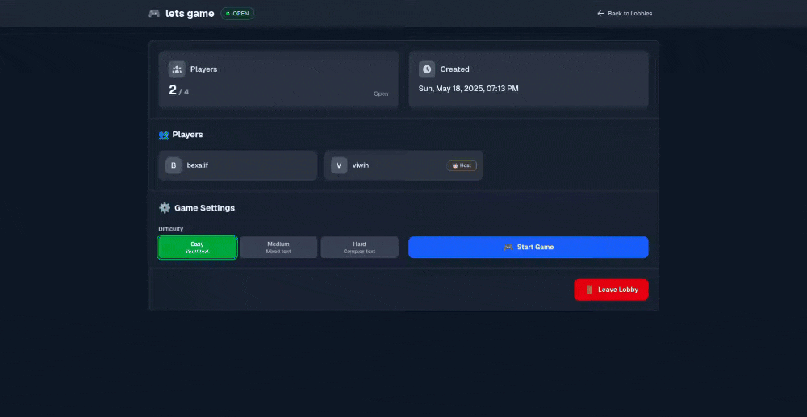
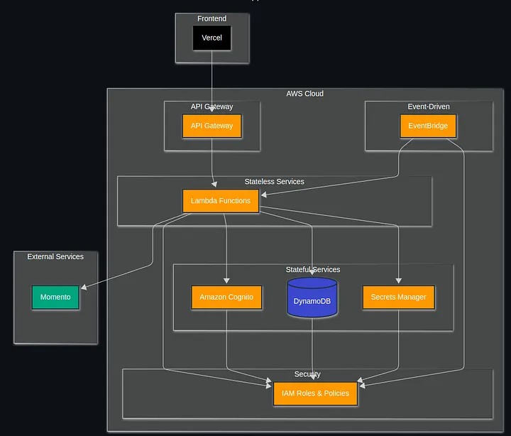

# Racing Through the Cloud: A TypeRacer-Inspired Game Built for the ServerlessGuru Hackathon

A serverless application built with AWS SAM, featuring a Next.js frontend and a serverless backend.

## Article:

Medium: [Racing Through the Cloud](https://medium.com/@eduardo.pedogutkoski/racing-through-the-cloud-a-typeracer-inspired-game-built-for-the-serverlessguru-hackathon-8a3522ff2003)

## Project Structure

```
.
├── code/
│   ├── frontend/          # Next.js frontend application
│   └── backend/           # Serverless backend functions
├── stacks/
│   ├── stateful/         # Stateful resources (DynamoDB, Cognito, etc.)
│   └── stateless/        # Stateless resources (API Gateway, Lambda functions)
├── docs/
│   └── api/              # API documentation
└── .github/
    └── workflows/        # GitHub Actions deployment workflows
```

## Game Preview



## Architecture



## Prerequisites

- Node.js 22.x
- AWS CLI configured with appropriate credentials
- AWS SAM CLI
- Yarn package manager

## Environment Setup

### Frontend

1. Navigate to the frontend directory:
   ```bash
   cd code/frontend
   ```

2. Create a `.env` file:
   ```
   NEXT_PUBLIC_API_BASE_URL=https://your-api-url/api
   API_BASE_URL=https://your-api-url/api
   ```

3. Install dependencies:
   ```bash
   yarn install
   ```

4. Start the development server:
   ```bash
   yarn dev
   ```

### Backend

1. Navigate to the backend directory:
   ```bash
   cd code/backend
   ```

2. Install dependencies:
   ```bash
   npm install
   ```

3. Build the project:
   ```bash
   npm run build
   ```

## Deployment

The project uses GitHub Actions for automated deployment. The deployment process is split into two stages:

1. Stateful Resources:
   - DynamoDB Table
   - Cognito User Pool
   - Event Bus
   - Secrets Manager

2. Stateless Resources:
   - API Gateway
   - Lambda Functions
   - Application Resources

### Manual Backend Deployment

To deploy the backend manually using SAM CLI:

1. First, deploy the stateful resources:
   ```bash
   cd stacks/stateful
   sam deploy --parameter-overrides "MomentoCacheApiKey=your-momento-key"
   ```

2. Then, deploy the stateless resources:
   ```bash
   cd ../stateless
   sam deploy --parameter-overrides "AppName=ServerlessHackaton"
   ```

Note: The stateless stack depends on the stateful stack, so make sure to deploy the stateful resources first.

### Required Secrets

The following secrets need to be configured in your GitHub repository:

- `AWS_ACCESS_KEY_ID`
- `AWS_SECRET_ACCESS_KEY`
- `MOMENTO_CACHE_API_KEY`

## Development

### Frontend Development

The frontend is built with Next.js and includes:
- Modern React features
- TypeScript support
- API proxy for backend communication
- Environment-based configuration

### Backend Development

The backend is built with AWS SAM and includes:
- Lambda functions for authentication
- API Gateway integration
- DynamoDB integration
- Cognito integration
- Event Bridge for event handling

## API Documentation

For detailed API documentation, please refer to the `docs/api` folder in the repository. This includes:
- Available endpoints
- Request/response formats
- Authentication requirements
- Example requests

## License

This project is licensed under the MIT License - see the LICENSE file for details.